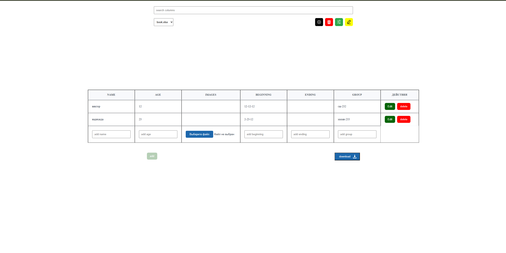

cat << "EOF" > README.md
# 📊 ExcelFlow — Interactive Excel Data Manager

  

  
  
  
  

---

## 📱 Overview

**ExcelFlow** is a modern for working with Excel files in the browser, enhanced with intelligent data interaction features.

Upload files, edit data, manage columns, and export results — without opening Excel.

---

## ✨ Features

- 📂 Upload Excel files  
- 🖱 Drag & drop support  
- 📊 Multiple tables support  
- 🔀 Quick table switching  
- 🧾 Unique ID for each table  

### Table Editing
- ➕ Add rows and columns  
- ✏️ Edit cell values  
- 📝 Rename columns  
- ❌ Delete columns  

### Column Types
- 🔤 Text  
- 🔢 Number  
- 🔗 Link  
- 📁 File  

### Data Control
- 🔍 Filtering system  
- 👁 Toggle column visibility  
- 🎯 Focus on a single column  

### Export
- 💾 Download edited data as Excel file

## 🤖 AI Assistant (Rule-Based)

The application includes a simple AI-like assistant based on rule-based logic.

It allows users to:
- interact with table data through structured actions
- quickly find and filter information
- simplify working with large datasets

The assistant processes user actions and determines appropriate operations such as filtering, editing, or navigating data.

This approach demonstrates basic principles of AI-agent behavior without heavy ML usage.

---

## 🧱 Architecture

### State Management
- React Hooks  
- Custom hooks  

### File Processing
- Excel parsing and generation  
- Dynamic data handling  

### UI
- Component-based structure  
- SCSS styling  

---

## 🖼 Screenshots

### Table View

  

---

## 🚀 How to Run

1. Clone the repository  
2. Install dependencies  
   npm install  

3. Start dev server  
   npm run dev  

4. Open in browser  

---

## 🧩 Tech Stack

- React  
- TypeScript  
- Vite  
- SCSS  

---

## 📄 License

Educational project for learning and portfolio use.

EOF

  

